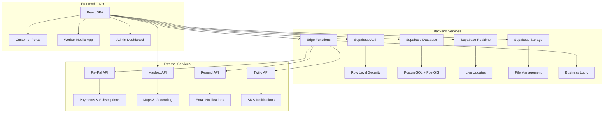
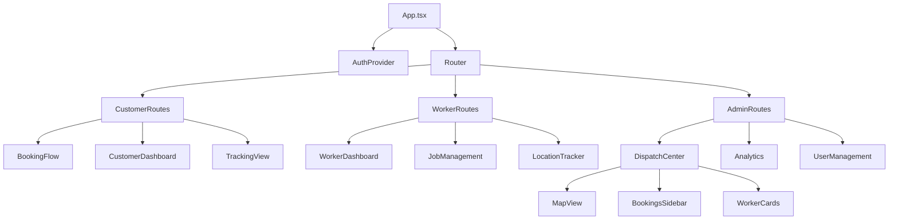
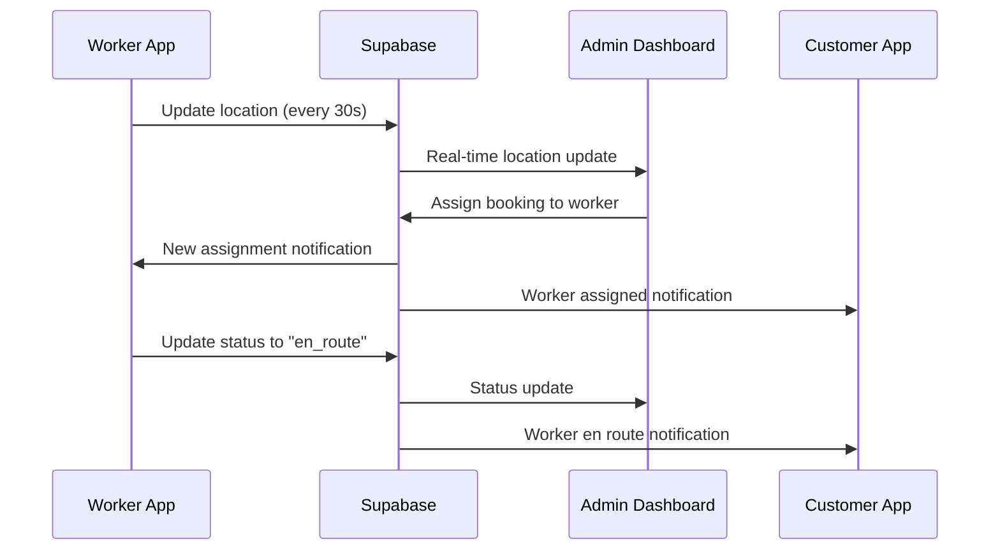

# Design Document

## Overview

Margarita's Cleaning Services application is a comprehensive full-stack web platform built with React/TypeScript frontend and Supabase backend. The system serves three primary user types: customers (booking services), workers (managing assignments), and administrators (dispatch and business management). The architecture emphasizes real-time capabilities, mobile responsiveness, and secure role-based access control.

## Architecture

### High-Level Architecture



### Technology Stack

- **Frontend**: React 19, TypeScript, Tailwind CSS, Vite
- **Backend**: Supabase (Auth, Database, Storage, Realtime, Edge Functions)
- **Database**: PostgreSQL with PostGIS extension
- **Maps**: Mapbox GL JS, Directions API, Geocoding API
- **Payments**: PayPal Checkout & Subscriptions API
- **Notifications**: Resend (email), Twilio (SMS)
- **Deployment**: Vercel (frontend), Supabase (backend)
- **State Management**: React Context + Custom Hooks
- **Forms**: React Hook Form with Yup validation
- **UI Components**: Custom components with Heroicons

## Components and Interfaces

### Frontend Component Architecture



### Key Frontend Components

#### 1. Dispatch Center (Admin)
- **MapView**: Full-screen Mapbox map with worker markers and booking pins
- **BookingsSidebar**: Drag-and-drop interface for unassigned bookings
- **WorkerCards**: Real-time worker status and assignment management
- **RouteOptimizer**: Calculates optimal routes using Mapbox Directions API

#### 2. Worker Mobile Interface
- **JobList**: Daily schedule with navigation integration
- **StatusUpdater**: Quick status change buttons
- **PhotoUploader**: Before/after photo capture and upload
- **LocationTracker**: Background location tracking service

#### 3. Customer Portal
- **BookingWizard**: Multi-step booking flow with service selection
- **TrackingMap**: Real-time worker location display
- **PaymentProcessor**: PayPal integration for bookings and subscriptions
- **ReviewSystem**: Post-service feedback and rating

### Backend Architecture

#### Supabase Edge Functions

1. **handle-paypal-webhook**
   - Processes PayPal payment confirmations
   - Updates booking and subscription statuses
   - Triggers notification workflows

2. **update-worker-location**
   - Validates and stores worker location updates
   - Implements rate limiting (max 2 updates per minute)
   - Triggers real-time updates to admin dashboard

3. **assign-booking-to-worker**
   - Handles booking assignments from dispatch center
   - Calculates optimal routes using Mapbox
   - Sends notifications to workers and customers

4. **calculate-optimal-routes**
   - Batch route optimization for multiple bookings
   - Considers traffic, worker capacity, and service windows
   - Returns optimized assignment suggestions

5. **send-notifications**
   - Unified notification service for email and SMS
   - Template-based messaging system
   - Delivery status tracking

6. **geocode-address**
   - Address validation and geocoding using Mapbox
   - Service area boundary checking
   - Coordinate storage for mapping features

## Data Models

### Core Database Schema

The application uses the existing schema with the following key tables:

#### Users & Authentication
```sql
-- Extends Supabase auth.users
users (
    id UUID PRIMARY KEY,
    email TEXT UNIQUE,
    full_name TEXT,
    phone TEXT,
    address TEXT,
    role user_role, -- 'customer', 'worker', 'admin'
    created_at TIMESTAMPTZ,
    updated_at TIMESTAMPTZ
)
```

#### Workers & Location Tracking
```sql
workers (
    id UUID PRIMARY KEY,
    profile_id UUID REFERENCES users(id),
    status worker_status, -- 'available', 'en_route', 'on_job', 'break', 'offline'
    current_location_lat DECIMAL(10, 8),
    current_location_lng DECIMAL(11, 8),
    last_location_update TIMESTAMPTZ,
    assigned_bookings_count INTEGER,
    vehicle_info TEXT
)

worker_locations (
    id UUID PRIMARY KEY,
    worker_id UUID REFERENCES workers(id),
    lat DECIMAL(10, 8),
    lng DECIMAL(11, 8),
    heading DECIMAL(5, 2),
    speed DECIMAL(6, 2),
    timestamp TIMESTAMPTZ
)
```

#### Bookings & Assignments
```sql
bookings (
    id UUID PRIMARY KEY,
    user_id UUID REFERENCES users(id),
    worker_id UUID REFERENCES workers(id),
    service_type service_type,
    scheduled_date DATE,
    scheduled_time TIME,
    address TEXT,
    status booking_status,
    price DECIMAL(10, 2),
    paypal_order_id TEXT,
    location_lat DECIMAL(10, 8),
    location_lng DECIMAL(11, 8),
    add_ons TEXT[]
)

assignments (
    id UUID PRIMARY KEY,
    booking_id UUID REFERENCES bookings(id),
    worker_id UUID REFERENCES workers(id),
    assigned_at TIMESTAMPTZ,
    status booking_status,
    estimated_arrival TIMESTAMPTZ,
    actual_arrival TIMESTAMPTZ,
    completion_time TIMESTAMPTZ
)
```

### Real-time Data Flow



## Error Handling

### Frontend Error Handling

1. **Network Errors**
   - Automatic retry with exponential backoff
   - Offline mode detection and queuing
   - User-friendly error messages with retry options

2. **Authentication Errors**
   - Automatic token refresh
   - Graceful logout on expired sessions
   - Redirect to login with return URL

3. **Validation Errors**
   - Real-time form validation with Yup schemas
   - Field-level error display
   - Accessibility-compliant error announcements

4. **Payment Errors**
   - PayPal error code mapping to user messages
   - Retry mechanisms for failed payments
   - Fallback payment methods

### Backend Error Handling

1. **Database Errors**
   - Connection pooling and retry logic
   - Transaction rollback on failures
   - Detailed error logging with context

2. **External API Errors**
   - Circuit breaker pattern for API calls
   - Fallback mechanisms (cached geocoding, etc.)
   - Rate limit handling with backoff

3. **Edge Function Errors**
   - Structured error responses
   - Webhook retry mechanisms
   - Dead letter queues for failed notifications

## Testing Strategy

### Frontend Testing

1. **Unit Tests**
   - Component testing with React Testing Library
   - Custom hook testing
   - Utility function testing
   - Target: 80% code coverage

2. **Integration Tests**
   - API integration testing with MSW
   - Authentication flow testing
   - Payment flow testing
   - Real-time feature testing

3. **E2E Tests**
   - Critical user journeys (booking, dispatch, payment)
   - Cross-browser compatibility
   - Mobile responsiveness testing
   - Accessibility testing

### Backend Testing

1. **Database Tests**
   - Schema validation
   - RLS policy testing
   - Performance testing with realistic data volumes
   - Migration testing

2. **Edge Function Tests**
   - Unit tests for business logic
   - Integration tests with external APIs
   - Webhook payload validation
   - Error handling scenarios

3. **Security Tests**
   - Authentication bypass attempts
   - SQL injection prevention
   - Rate limiting validation
   - Data privacy compliance

### Performance Testing

1. **Load Testing**
   - Concurrent user simulation
   - Database query optimization
   - Real-time connection limits
   - API rate limit testing

2. **Mobile Performance**
   - Location tracking battery impact
   - Offline functionality
   - Network optimization
   - Bundle size optimization

## Security Architecture

### Authentication & Authorization

1. **Supabase Auth Integration**
   - JWT-based authentication
   - Social login providers (Google, Facebook)
   - Magic link authentication
   - Multi-factor authentication support

2. **Row Level Security (RLS)**
   - User-specific data access policies
   - Role-based feature access
   - Worker location privacy controls
   - Admin-only data protection

### Data Protection

1. **Encryption**
   - TLS 1.3 for all communications
   - Database encryption at rest
   - Sensitive data field encryption
   - API key secure storage

2. **Privacy Controls**
   - Worker location visibility restrictions
   - Customer data anonymization options
   - GDPR compliance features
   - Data retention policies

### API Security

1. **Rate Limiting**
   - Location update limits (2/minute per worker)
   - API endpoint throttling
   - Webhook replay protection
   - DDoS protection

2. **Input Validation**
   - Schema validation for all inputs
   - SQL injection prevention
   - XSS protection
   - File upload restrictions

## Real-time Features

### Supabase Realtime Integration

1. **Worker Location Updates**
   - Real-time position streaming
   - Efficient delta updates
   - Connection management
   - Offline handling

2. **Dispatch Operations**
   - Live booking assignments
   - Status change propagation
   - Multi-admin synchronization
   - Conflict resolution

3. **Customer Tracking**
   - Worker ETA updates
   - Service status notifications
   - Real-time messaging
   - Progress tracking

### WebSocket Management

1. **Connection Handling**
   - Automatic reconnection
   - Heartbeat monitoring
   - Graceful degradation
   - Error recovery

2. **Data Synchronization**
   - Optimistic updates
   - Conflict resolution
   - State reconciliation
   - Offline queue management

## Mobile Optimization

### Progressive Web App (PWA)

1. **Service Worker**
   - Offline functionality
   - Background sync
   - Push notifications
   - Cache management

2. **Mobile Features**
   - Touch-optimized interface
   - Geolocation integration
   - Camera access for photos
   - Native app-like experience

### Performance Optimization

1. **Bundle Optimization**
   - Code splitting by route
   - Lazy loading components
   - Tree shaking
   - Asset optimization

2. **Network Optimization**
   - Request batching
   - Caching strategies
   - Compression
   - CDN integration

## Deployment Architecture

### Frontend Deployment (Vercel)

1. **Build Configuration**
   - Environment-specific builds
   - Asset optimization
   - Static generation where possible
   - Edge function deployment

2. **Monitoring & Analytics**
   - Performance monitoring
   - Error tracking
   - User analytics
   - A/B testing framework

### Backend Deployment (Supabase)

1. **Database Management**
   - Migration scripts
   - Backup strategies
   - Performance monitoring
   - Scaling configuration

2. **Edge Functions**
   - Serverless deployment
   - Environment management
   - Logging and monitoring
   - Error alerting

This design provides a robust, scalable foundation for Margarita's Cleaning Services application with emphasis on real-time capabilities, security, and user experience across all platforms.